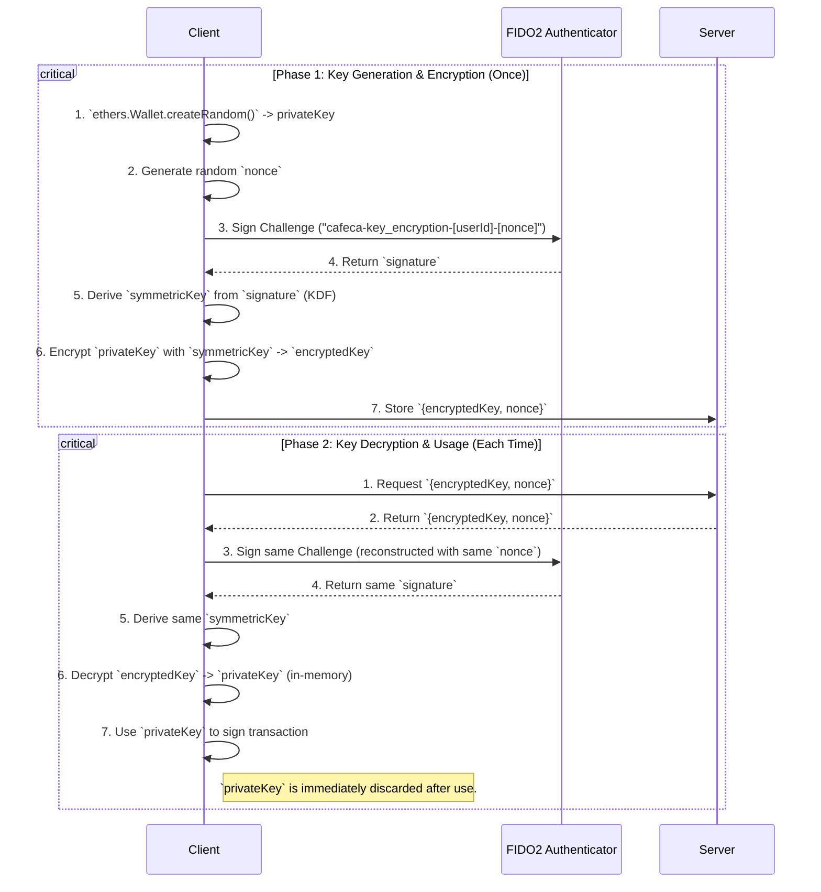
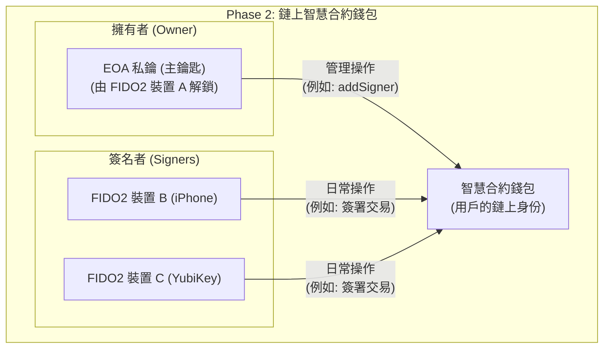

# **技術設計文件：FIDO2 鏈上身份金鑰架構**

## 1\. 設計背景與必要性

**目標**：為了實現專案最終將用戶身份與行為上鏈的去中心化願景，我們必須為每位用戶生成一把由其自主控制的區塊鏈私鑰。

**必要性**：傳統的私鑰管理方案（如助記詞、Keystore + 密碼）與本專案 FIDO2/Passkey 的無密碼核心理念相悖。因此，我們需要設計一套能利用 FIDO2 硬體級安全性，同時又能安全管理鏈上私鑰的架構。本設計旨在為 Phase 1 建立一個安全、非託管的金鑰基礎，並為 Phase 2 的智慧合約錢包演進鋪路。

## 2\. Phase 1 金鑰設計：動態解密模型 (Dynamic Decryption)

此為當前階段的實作核心。

### 2.1 設計原則 (詳細闡述)

本設計的基石是**分離**「金鑰生成」與「金鑰存取」兩個環節。FIDO2 在此架構中扮演的是**解鎖工具**，而非生成工具。這個核心思想是為了在不犧牲 FIDO2 無密碼體驗的前提下，實現一個安全、非託管的區塊鏈金鑰管理方案。

#### 1. 金鑰生成：一次性、由高熵隨機源生成
**原則闡述**：用戶的區塊鏈私鑰**必須且只能**在首次設定時，透過密碼學安全偽隨機數生成器 (CSPRNG) 產生一次。我們使用 `ethers.Wallet.createRandom()` 正是為了此目的。

**技術細節與必要性**：
* **不可預測性**: 區塊鏈私鑰的安全性完全建立在其不可預測性之上。使用高熵隨機源可以確保金鑰的生成是統計上隨機的，從而有效抵抗暴力破解或基於生成模式的猜測攻擊。
* **避免確定性派生**: 我們**堅決不採用**從任何靜態資訊（如密碼、使用者名稱、甚至是固定的 FIDO2 簽章）來「確定性派生」私鑰的方案。確定性派生雖然看起來方便，但其安全性完全取決於輸入源的熵值和派生過程的強度。一旦輸入源洩漏或派生過程被破解，私鑰將被永久破解。我們的模型中，原始私鑰本身就是熵的最高來源。

#### 2. 金鑰保護：派生一次性對稱金鑰進行加密
**原則闡述**：我們不直接用 FIDO2 簽章來派生私鑰，而是用它來派生一個**一次性的對稱加密金鑰 (Symmetric Key)**，並使用此金鑰透過 AES-GCM 演算法來加密一個已存在的私鑰。

**技術細節與必要性**：
* **職責分離**: FIDO2 的核心是**身份驗證**，其簽章演算法（如 ECDSA）的設計目標是證明「持有某把鑰匙的人在某個時間點同意了某件事」，而不是作為一個高熵的金鑰生成源。將 FIDO2 用於派生「解鎖鑰匙」而非「主鑰匙」，是對其能力的正確應用。
* **AES-GCM 的優勢**: 我們選用 AES-GCM 作為對稱加密演算法，因為它是一個帶有關聯數據的認證加密 (AEAD) 方案。這意味著它不僅提供機密性（加密），還提供**完整性**和**真實性**驗證，可以防止密文被篡改。
* **金鑰生命週期管理**: 派生出的對稱金鑰只在加解密的瞬間存在於前端記憶體中，用完即焚。這與直接操作一個長期存在的明文私鑰相比，極大地縮小了攻擊面。

#### 3. 後端零知識：僅儲存密文與鹽
**原則闡述**：後端資料庫僅儲存加密後的私鑰密文 (`encryptedBlockchainKey`) 及用於派生解密金鑰的「鹽」(`derivationNonce`)。後端伺服器在任何時候都無法存取或還原用戶的明文私鑰。

**技術細節與必要性**：
* **降低後端風險**: 這是非託管錢包設計的核心。即使我們的後端伺服器、資料庫被完全入侵，攻擊者竊取到的也只是一堆對他們來說毫無意義的加密數據。沒有用戶的 FIDO2 實體裝置（iPhone, YubiKey）進行簽章，這些數據就是一串亂碼。
* **用戶主權**: 此原則將金鑰的最終控制權交還給用戶。只有用戶透過自己的裝置進行生物辨識驗證，才能在自己的瀏覽器中臨時解密金鑰。平台方無法凍結、存取或濫用用戶的資產。

#### 4. 防禦重放攻擊：使用一次性的隨機 Nonce
**原則闡述**：所有 FIDO2 簽章請求的 `challenge` 都必須包含一個**由密碼學安全隨機數生成器產生的一次性 `nonce`**。這是本設計安全性的關鍵，它確保了即使單次 `signature` 被截獲也無法被重用。

**技術細節與必要性**：
* **Challenge-Response 機制**: FIDO2 是一個 Challenge-Response 協議。其安全性依賴於 `challenge` 的不可預測性。如果 `challenge` 是靜態或可預測的，協議就會退化，產生可被重放的簽章。
* **Nonce 的作用**: `nonce` (Number used once) 是一個隨機數，它被包含在簽章的內容中。在我們的設計中，`nonce` 在加密時生成並與密文一同儲存。解密時，我們用同一個 `nonce` 重構出 `challenge`。FIDO2 驗證器會對 `challenge` 進行簽章，由於 `nonce` 存在，即使 `userId` 等其他部分不變，`challenge` 也是獨一無二的。
* **為何關鍵**: 這徹底杜絕了重放攻擊。攻擊者即便攔截了某次成功的 `signature`（對應 `nonceA`），也無法用它來解密下一次使用 `nonceB` 保護的資料。每一次解密操作都需要用戶進行一次全新的、針對當前 `nonce` 的即時簽章。

#### 5. 意圖明確化：使用品牌與操作前綴
**原則闡述**：所有 `challenge` 均包含 `cafeca-` 品牌前綴及操作意圖 (e.g., `key_encryption`)，以在密碼學上區分不同目的的簽章請求。

**技術細節與必要性**：
* **領域分離 (Domain Separation)**: 這是密碼學工程中的一個重要原則。在一個系統中，同一把金鑰（在此情境下是 FIDO2 的私鑰）不應該被用於多種不同的目的（例如，同時用於登入驗證和金鑰解密），否則可能導致跨協議攻擊 (Cross-protocol Attack)。
* **實踐方式**: 透過在 `challenge` 中加入清晰的前綴，我們創造了不同的「領域」。
    * `cafeca-login-[nonce]` 用於**登入驗證**。
    * `cafeca-key_encryption-[userId]-[nonce]` 用於**金鑰解密**。
* **安全性與使用者體驗**: 即使 FIDO2 簽章演算法本身是安全的，這種明確的領域分離也能防止潛在的邏輯漏洞。此外，在未來，某些 FIDO2 驗證器可能會在驗證提示中顯示部分 `challenge` 內容，這些前綴可以讓用戶清楚地知道他們正在授權的是一項與 `cafeca` 相關的、高權限的操作，而不是普通的網站登入。
### 2.2 架構流程

## 3. Phase 2 演進目標：鏈上主權身份

Phase 1 的設計是為了 Phase 2 的宏大目標服務。Phase 1 中生成的 `IdentityAccount` **外部擁有帳戶 (Externally Owned Account, EOA)** 私鑰，是未來用戶鏈上主權身份的**所有權根 (Root of Trust)**。

### 3.1 目標闡述

Phase 2 的目標是將每個 `IdentityAccount` 從一個由後端管理的 EOA，升級為一個**鏈上的智慧合約錢包** (例如，遵循 ERC-4337 的帳戶抽象，或 Gnosis Safe 類型的多簽錢包)。

### 3.2 演進路徑

1.  **部署智慧合約錢包**: 為用戶部署一個新的智慧合約錢包，並將其**擁有者 (Owner)** 設定為 Phase 1 生成的 EOA 地址 (`blockchainAddress` 欄位)。
2.  **實現簽名者模型 (Signer Model)**: 這一步將實現從 EOA 到鏈上多裝置主權。我們將允許用戶透過其 EOA 主鑰匙（Owner）授權，將 `Authenticator` 表中記錄的所有 FIDO2 裝置的公鑰，新增為智慧合約錢包的**合法簽名者 (Signers)**。
3.  **權限分離**:
      * **日常操作**: 用戶可以使用任一已註冊的 FIDO2 裝置（Signer）直接發起並簽署智慧合約錢包的交易，實現真正的多裝置原生鏈上操作。
      * **管理操作**: Phase 1 的 EOA 主鑰匙，其角色將轉變為高安全性的**管理員金鑰**，專門用於新增/移除 Signer 裝置、設定恢復機制等高權限操作。

#### 3.2.1 詳細闡述：實現簽名者模型 (Signer Model)

##### **概念**

Phase 2 的核心是將單點控制的 EOA，升級為一個由多個「簽名者 (Signers)」共同管理的智慧合約錢包。`Authenticator` 表中的每一個 FIDO2 裝置，其公鑰都可以被 Owner 授權，成為智慧合約錢包的合法簽名者。此模型的轉變，意味著用戶的鏈上身份不再依賴於單一一把（被加密的）私鑰，而是由一組他們自己擁有的、物理的 FIDO2 裝置來共同保障。

#### 3.2.2 技術實作路徑

要實現此「簽名者模型」，需要開發一個「裝置管理」功能，其流程如下：

1. 讀取裝置列表

* **後端職責**: 建立一個受保護的新 API 端點 (例如 `GET /api/v1/secure/authenticators`)。該 API 應回傳當前用戶在 `Authenticator` 資料表中所有已註冊的 FIDO2 裝置，至少需包含 `credentialPublicKey`。
* **前端職責**: 在「裝置管理」介面中呼叫此 API，獲取使用者所有可用的 FIDO2 裝置列表以供選擇。

2. 構造授權交易 (Management Transaction)

* **前端職責**:
    * 提供一個「授權此裝置為鏈上簽名者」的介面。
    * 當用戶選擇要授權的裝置時，前端需要執行以下操作：
        a. **公鑰轉換**: 將從後端獲取的 FIDO2 `credentialPublicKey` (為 CBOR 編碼的 COSE Key) 轉換為智慧合約可辨識的以太坊地址。
           > **技術註解**: 此轉換涉及解析 COSE 金鑰以提取出 uncompressed SECP256k1 公鑰，然後對其進行 Keccak256 雜湊以得到最終地址。這需要專門的密碼學函式庫輔助。
        b. **構造交易**: 構造一筆指向**用戶智慧合約錢包地址**的交易。此交易的 `data` 欄位將包含一個函式呼叫，例如 `addSigner(signerAddress)`，其中 `signerAddress` 就是步驟 (a) 轉換出的地址。

3. 使用主鑰匙進行授權簽署

* **前端職責**:
    * 為了執行上一步構造的管理交易，用戶必須證明他們是合約的 Owner。
    * 此時，我們會觸發 Phase 1 的「**動態解密**」流程：
        a. 提示用戶「請使用 Passkey 授權管理您的裝置」，並呼叫 `decryptAndUseBlockchainKey` 函式。
        b. 在前端記憶體中臨時解密出 EOA **主鑰匙** (`ethers.Wallet` 物件)。
        c. 使用這把主鑰匙，對上一步構造的管理交易進行簽署。
    * 將簽署後的交易發送到區塊鏈。

4. 鏈上驗證與執行

* **智慧合約職責**:
    * 智慧合約錢包接收到這筆交易。
    * 合約的 `addSigner` 函式會首先透過 `onlyOwner` 或類似的修飾符，驗證交易的發起者 (`msg.sender`) 是否為合約的 `Owner`（即 EOA 主鑰匙的地址）。
    * 驗證通過後，合約執行函式邏輯，將新的 FIDO2 裝置地址加入到合約內部儲存的「合法簽名者列表」中。

##### **演進後的日常操作**

一旦裝置被新增為 Signer，日常的交易簽署流程將變得極為流暢：

  * **無須解密主鑰匙**：用戶不再需要執行 Phase 1 的「解密」流程來獲取 EOA 主鑰匙。
  * **直接簽署**：當需要簽署一筆普通交易時（例如發表評論、投資），前端可以直接呼叫 `fido2ClientService.startLogin`，並用一個特定於**交易內容**的 `challenge` 來請求 FIDO2 裝置簽名。
  * **鏈上驗證簽名者**：智慧合約錢包在收到交易時，會直接驗證 `signature` 是否來自其內部「合法簽名者列表」中的某一個公鑰。驗證通過即可執行。

#### 3.2.4 演進架構圖

**總結**: 透過這個演進，我們將 `Authenticator` 資料表從一個僅用於「鏈下解密」的裝置列表，轉變為一個**鏈上智慧合約錢包的多重簽名者**的管理來源，真正實現了用戶對其鏈上身份的多裝置主權控制。